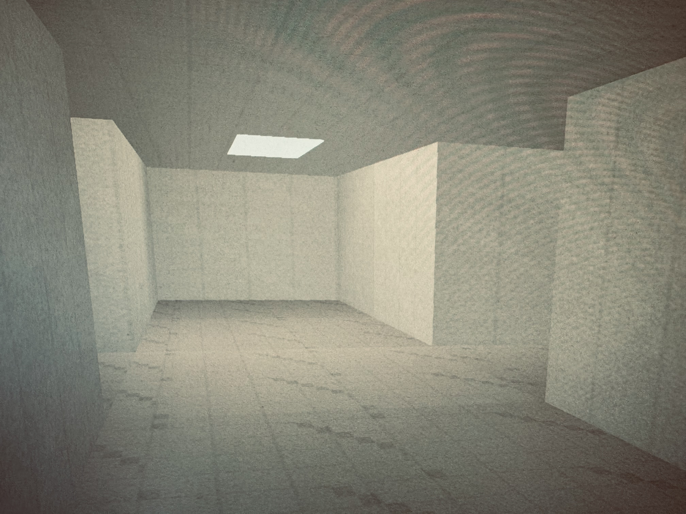

# Liminal Vibes

A first-person 3D liminal horror prototype built with Python + Ursina.



## Features
- Finite maze levels that grow larger each time you reach the exit door in the wall.
- Procedural textures on walls, floor, and ceiling for subtle surface detail.
- First-person movement (`WASD`) and camera look with both arrow keys and mouse/touchpad.
- Sprint with `Shift` plus stamina depletion/refill bar.
- Monster spawns after exploration time, then chases player.
- Monster starts slower, ramps speed in stepped phases with an upper cap.
- Monster has simple procedural limb walk animation while moving.
- Monster never spawns in your current line of sight.
- When out of view, monster can occasionally teleport to another hidden location.
- Level 5 becomes a one-way hallway challenge with the exit door at the far end.
- On death: `GAME OVER` screen with survival time in `MM:SS`.
- Every restart uses a new random seed.

## Quick Start

```bash
python3 -m venv .venv
source .venv/bin/activate
pip install -r requirements.txt
python main.py
```

## Test Mode

Use test mode to spawn the monster immediately. In this mode, the monster still chases but cannot kill the player.
An extra HUD appears with elapsed time, current monster speed, and whether the monster would have killed the player.

```bash
python main.py --test
```

To enable test mode only when you reach level 5, use:

```bash
python main.py --test-level-5
```

To jump directly to a specific level (for example, the level 5 hallway), use:

```bash
python main.py --start-level 5
```

## Controls
- Move: `WASD`
- Look: Arrow keys + mouse/touchpad
- FOV adjust: `Q` / `E`
- Sprint: Hold `Shift`
- Restart after death: `R`

## Run Tests

```bash
python run_tests.py
```

## Building Installers (Windows & macOS, no prerequisites for players)

Players don't need Python installed — they just download and run the
installer for their OS:

- **Windows**: `LiminalVibesSetup.exe` — a standard installer with Start Menu/
  desktop shortcuts and an uninstaller.
- **macOS**: `LiminalVibes.dmg` — open it and drag Liminal Vibes into
  Applications.

### Recommended: build both via GitHub Actions

PyInstaller cannot cross-compile, so each installer must be built on its
native OS. The workflow in `.github/workflows/build-installers.yml` handles
this automatically using GitHub-hosted Windows and macOS runners:

- Push a tag like `v1.0.0` to build both installers and attach them to a new
  GitHub Release, or
- Trigger it manually from the Actions tab ("Run workflow") and download the
  artifacts.

No local setup is required to use this — it all runs in CI.

### Building locally

To build on your own machine instead, run the matching OS's steps:

```bash
pip install -r requirements-build.txt
python build_installer.py
```

- On Windows this also requires [Inno Setup](https://jrsoftware.org/isinfo.php)
  (a build-time tool only) to be installed and `iscc`/`ISCC.exe` on your PATH.
  Output: `installer/Output/LiminalVibesSetup.exe`.
- On macOS this uses only built-in tools (`hdiutil`). Output:
  `dist/LiminalVibes.dmg`.

